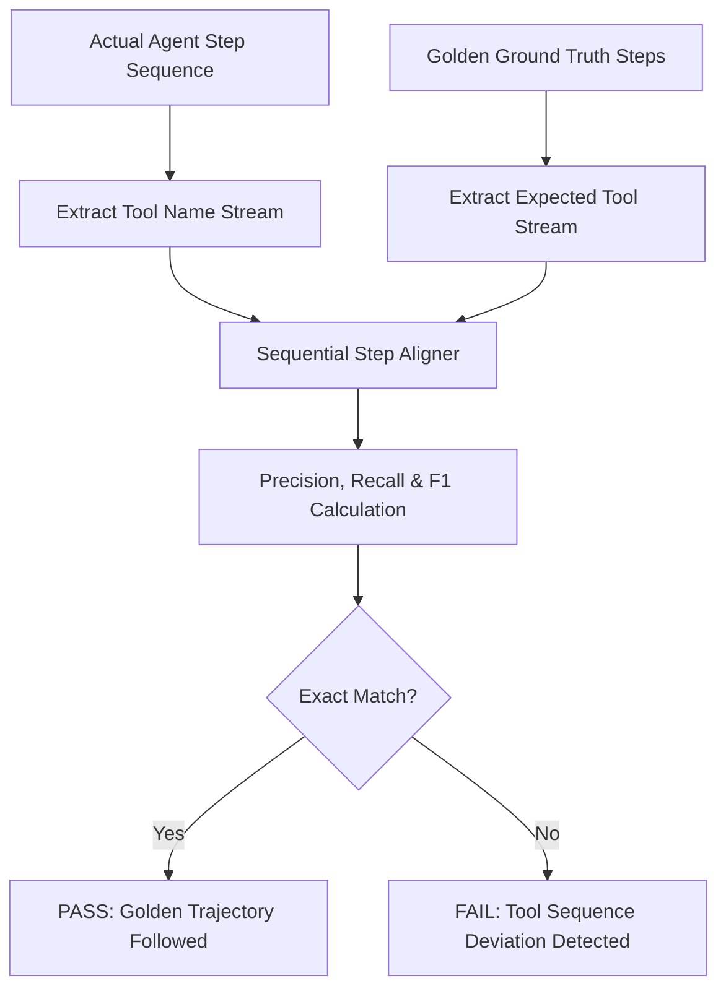

# genpark-agent-trajectory-pass-fail-evaluator-skill

Agent Skill implementing **Agent Execution Trajectory Pass/Fail Verification** in 100% Python standard library.

## Architectural Flow

```mermaid
flowchart TD
    Actual["Actual Agent Step Sequence"] --> ExtractAct["Extract Tool Name Stream"]
    Golden["Golden Ground Truth Steps"] --> ExtractExp["Extract Expected Tool Stream"]
    ExtractAct & ExtractExp --> Matcher["Sequential Step Aligner"]
    Matcher --> Stats["Precision, Recall & F1 Calculation"]
    Stats --> PassFail{"Exact Match?"}
    PassFail -->|Yes| P["PASS: Golden Trajectory Followed"]
    PassFail -->|No| F["FAIL: Tool Sequence Deviation Detected"]
```
